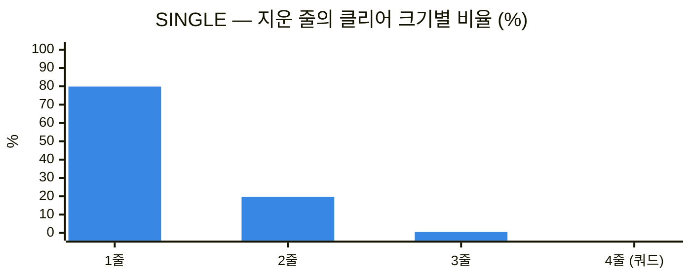
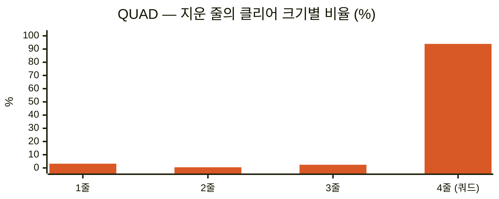
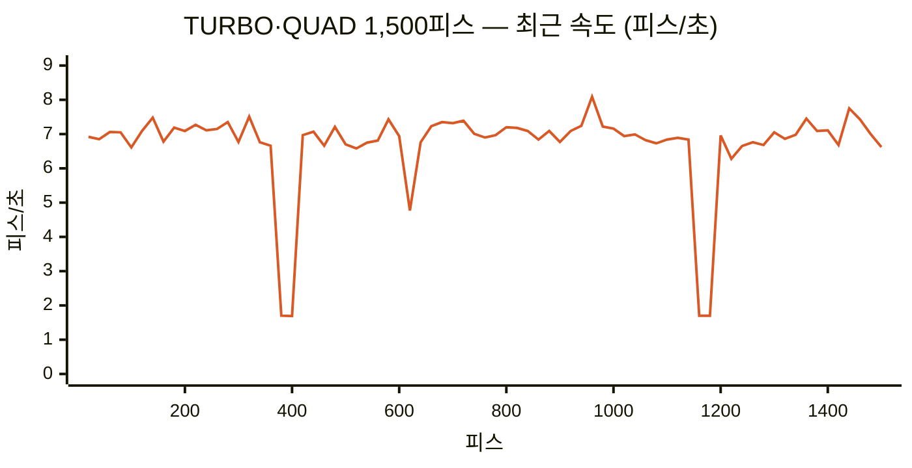

<p align="center">
  
</p>

<h1 align="center">Tetrio-AI</h1>

<p align="center">
  TETR.IO ZEN 모드를 자동으로 플레이하는 봇입니다. 데스크톱 앱의 화면을 읽고,<br>
  로컬 평가 함수로 배치를 정해 초당 최대 약 7피스로 플레이합니다.
</p>

<p align="center">
  
  
  
  
  
  <br>
  
  
  
</p>

<p align="center"><a href="README.md">English</a> · <b>한국어</b></p>

> 테트리오 게임플레이 연구·실험용입니다. 이를 랭킹전 등에 사용했을 시 계정 제한 등 불이익은 사용자 본인에게 있습니다.

테트리스나 TETR.IO가 처음이라면 [용어](#용어)부터 보세요.

## 시작

Node.js 18 이상과 TETR.IO 데스크톱 앱(`%LOCALAPPDATA%\Programs\tetrio-desktop\TETR.IO.exe`)이 필요합니다.

```bash
npm install
npm start
```

ZEN 화면을 찾으면 시작 메뉴가 뜹니다. 콘솔에 `[속도]-[방식]` + Enter로 속도와 라인 클리어 방식을 고르며, 플레이 중에도 같은 명령으로 바꿉니다.

| | SINGLE (`s`) | QUAD (`q`) |
|---|---|---|
| **BASIC** (`1`) | `1-s` | `1-q` |
| **RAPID** (`2`) | `2-s` | `2-q` |
| **TURBO** (`3`) | `3-s` | `3-q` |

`status`는 통계, `Ctrl+C`는 종료입니다. 플레이 중에는 TETR.IO 창을 가리지 마세요. 가려지면 게임이 멈춥니다.

봇은 TETR.IO를 디버그 포트(9222)를 연 채로 실행하고, 봇이 끝나도 앱은 그 상태로 계속 돕니다. 포트가 열려 있는 동안에는 같은 PC의 다른 프로그램이 로그인된 게임을 조작할 수 있으니, 다 쓴 뒤에는 TETR.IO를 종료하세요.

## 속도

| 속도 | 동작 | 실측 피스/초 |
|---|---|---:|
| BASIC | 매 피스 화면을 읽은 뒤 계산하고 입력 | 2.3~2.4 |
| RAPID | 화면 읽기와 계산을 새 피스 대기와 겹쳐 수행 | 4.1~4.3 |
| TURBO | 창 크기별로 보정한 입력으로 최대 2피스 앞서 두고, 화면 검증은 뒤에서 따로 | 5.8~7.0 |

**파랑 = SINGLE, 주황 = QUAD.** 레벨 전환이 없는 구간의 실측값입니다.

```mermaid
%%{init: {"xyChart": {"height": 360}, "themeVariables": {"xyChart": {"plotColorPalette": "#3987e5, #d95926"}}}}%%
xychart-beta
    title "속도·방식별 플레이 속도 (피스/초)"
    x-axis ["BASIC·SINGLE", "BASIC·QUAD", "RAPID·SINGLE", "RAPID·QUAD", "TURBO·SINGLE", "TURBO·QUAD"]
    y-axis "피스/초" 0 --> 8
    %% 음수 = 막대 없음. mermaid는 0도 8px 막대로 그리므로 값이 없는 칸은 -5로 둔다.
    bar [2.42, -5, 4.13, -5, 5.84, -5]
    bar [-5, 2.33, -5, 4.29, -5, 6.99]
```



## 라인 클리어 방식

| 방식 | 플레이 |
|---|---|
| SINGLE | 줄이 차는 대로 바로 지웁니다. 대부분 1줄 클리어입니다 |
| QUAD | 오른쪽 끝 열을 비워 두고 쌓은 뒤, 세운 I 미노로 4줄을 한 번에 지웁니다. 스택이 10줄을 넘으면 잠시 SINGLE처럼 낮춥니다 |





QUAD는 피스당 점수가 SINGLE의 **2.5배**(110.7 대 44.0)입니다. 실게임에서도 지운 줄의 93.5~95%가 쿼드였습니다. 대신 스택이 평균 5.4줄로 SINGLE(2.8줄)보다 높게 쌓입니다. 비율과 점수는 오프라인 시뮬레이션에서 방식마다 18,000피스를 둔 결과입니다.

## AI 구조

이 봇의 "AI"는 학습된 신경망이 아닙니다. 가능한 배치를 모두 따져 보고, 몇 개의 가중치로 이루어진 공식으로 점수를 매기는 고전적인 탐색입니다. GPU도, 학습 데이터도, 네트워크도 필요 없고, 한 수를 정하는 데 2ms가 걸리지 않습니다.


1. **인식:** 10×20 필드를 한 칸씩 읽습니다. 색이 충분히 밝고 선명하면 채워진 칸으로 보고, 색상으로 피스 종류를 가립니다(노랑 O, 하늘색 I 등). NEXT와 HOLD의 피스는 모양으로 알아봅니다. 학습하는 부분은 없고, 기준값은 고정입니다.
2. **탐색:** 키로 닿을 수 있는 모든 배치(회전 × 열, 피스당 최대 34개)를 지금 피스와 HOLD 피스로 각각 시도하고, 각 결과에서 한 피스 앞을 더 내다봅니다. 한 수에 최대 약 2,300개 보드를 봅니다. RAPID와 TURBO는 상위 12개 배치에서만 앞을 내다봅니다.
3. **평가:** 결과 보드마다 점수를 매겨 가장 높은 배치를 고릅니다.

### 파라미터

SINGLE은 Pierre Dellacherie가 손으로 조정한 평가 함수를 씁니다(2003년. Thiery & Scherrer, *Building Controllers for Tetris*, 2009 참고).

| 특징 | 가중치 |
|---|---:|
| 피스가 놓인 높이 | −4.500 |
| 지운 줄 수 × 그 줄에 들어간 자기 칸 수 | +3.418 |
| 가로 방향으로 채움↔빔이 바뀌는 횟수 | −3.217 |
| 세로 방향으로 채움↔빔이 바뀌는 횟수 | −9.348 |
| 구멍 수 | −7.899 |
| 우물 깊이 누적 | −3.386 |

QUAD는 스택 관련 항목을 그대로 쓰되 오른쪽 끝 열을 벽으로 보고, "지운 줄" 항목 대신 아래 값을 씁니다.

| 항목 | 값 |
|---|---:|
| 오른쪽 끝 열에 채워진 칸 하나당 | −20 |
| 4줄 한 번에 지우기 | +60 |
| 1~3줄씩 지운 줄 하나당 | −10 |
| HOLD에 I 피스를 보관 | +30 |
| QUAD가 SINGLE처럼 점수를 매기기 시작하는 스택 높이 | 10줄 |

그 밖에 RAPID는 키 한 번에 1점을 빼서 점수가 비슷하면 키가 적게 드는 배치를 고르고, TURBO는 대신 예상 입력 시간 1ms당 0.01점을 뺍니다. 평가 함수에는 **손으로 정한 값 11개(SINGLE 6 + QUAD 5)가 있고, 학습된 파라미터는 없습니다**.

### 가중치를 정한 방법

- **SINGLE:** Dellacherie가 발표한 값을 그대로 씁니다.
- **QUAD:** 봇이 보는 것과 같은 규칙(7-bag, NEXT 5개, HOLD)의 테트리스 시뮬레이터 [`probe/quad_sim.js`](probe/quad_sim.js)로 오프라인 조정했습니다.
  - 가중치 조합 약 30가지를 각각 6,000피스 이상 두게 하고, 쿼드 비율·피스당 점수·스택 높이·게임 오버를 비교했습니다.
  - 가장 좋은 조합을 처음 보는 피스 순서 6가지(각 3,000피스)로 다시 확인한 뒤, 실게임에서 쿼드 93.5~95%로 확인했습니다.
- **TURBO 입력 타이밍:** 조정이 아니라 실측입니다. 처음 보는 창 크기에서 TURBO가 스폰 대기 120·95·80·65ms마다 120피스씩 둬 보고, 오배치 없이 통과한 가장 빠른 값을 저장합니다.

## 실게임 기록



TURBO·QUAD로 1,500피스를 282초에 두었고, 쿼드는 140회, 오배치는 0회였습니다. 평소 약 7 피스/초를 유지했습니다. 속도가 떨어진 세 곳은 레벨 전환 2회와 높은 스택 1회로, 그동안은 RAPID가 맡았다가 TURBO로 돌아왔습니다.

모든 실행 기록과 그래프 데이터의 출처는 **[플레이 로그 모음](docs/PLAY-LOGS-KR.md)** 에 있습니다.

## 실행 옵션

| 옵션 | 기본값 | 용도 |
|---|---|---|
| `--mode basic/rapid/turbo` | basic | 시작 속도 |
| `--strategy single/quad` (`s`/`q`) | single | 라인 클리어 방식 |
| `--pieces N` | 무제한 | 배치 수 제한 |
| `--port P` | 9222 | CDP 포트 |
| `--calibration FILE` | 창 크기별 자동 선택 | 지정한 TURBO 보정 파일만 사용 |
| `--restart` | 꺼짐 | 앱 재시작 |
| `--restart-every N` / `--restart-mins M` | 2500 / 20 | 먼저 도달한 조건에서 재시작, 0은 해제 |
| `--quality Q` | 85 | JPEG 품질(1–100) |
| `--postdrop N` | 모드별 | BASIC/RAPID 드롭 후 대기(ms, 최소 90) |
| `--no-adblock` | 꺼짐 | 광고 차단 비활성화 |

TURBO는 창 크기마다 입력 보정이 필요합니다. 처음 보는 크기면 시작할 때 자동으로 보정하며 2~4분 걸립니다. 최대화 창에서는 보정이 실패할 수 있으니 창 모드로 실행하세요. 자세한 내용은 [TURBO 동작·검증](docs/TURBO-RESULTS-KR.md#실행과-보정)에 있습니다.

## 용어

| 용어 | 뜻 |
|---|---|
| TETR.IO | 온라인 테트리스 게임입니다. 이 봇은 Windows 데스크톱 앱을 조작합니다 |
| ZEN | TETR.IO의 혼자 하는 무한 모드입니다. 줄을 지울수록 레벨이 오르고, 진행 상황은 계정에 저장됩니다 |
| 피스 | 네 칸짜리 블록(미노)입니다. I·O·T·S·Z·J·L 일곱 종류가 있습니다 |
| PPS | 초당 놓는 피스 수(pieces per second), 이 문서의 "피스/초"입니다 |
| 스택 | 필드 바닥부터 쌓인 블록입니다. 높이는 줄 수로 셉니다 |
| 라인 클리어 | 가로 한 줄이 꽉 차면 사라지는 것입니다. 한 번에 1줄이면 싱글, 4줄이면 쿼드입니다. 일반 클리어 중에서는 쿼드의 줄당 점수가 가장 높습니다 |
| 하드 드롭 | 피스를 지금 위치에서 바닥까지 한 번에 떨어뜨리는 키입니다 |
| NEXT | 다음에 나올 피스 5개를 미리 보여 주는 칸입니다 |
| HOLD | 지금 피스를 보관했다가 나중에 꺼내 쓰는 칸입니다 |
| 7-bag | 일곱 종류를 한 벌씩 섞어 순서대로 내보내는 방식입니다. 같은 피스가 너무 오래 안 나오는 일이 없습니다 |
| 레벨 전환 | 레벨이 오를 때 나오는 연출입니다. 그동안 필드가 잘 보이지 않아 봇이 잠시 느려집니다 |
| 오배치 | 봇이 계산한 자리와 다른 곳에 피스가 놓인 경우입니다. 화면으로 추정한 값입니다 |
| CDP | Chrome DevTools Protocol입니다. 데스크톱 앱의 화면을 캡처하고 키를 보내는 통로입니다 |
| 보정 | TURBO가 창 크기마다 키 입력 간격을 재서 저장하는 과정입니다 |
| DAS / ARR | 방향키를 누르고 있을 때 연속 이동이 시작되기까지의 지연과 이동 속도입니다(게임 설정) |

## 개발·문서

`npm test`로 회귀 테스트를 실행합니다. AI는 `src/ai.js`, 보드 모델은 `src/board.js`, BASIC·RAPID 루프는 `src/bot.js`, TURBO는 `src/turbo.js`에 있습니다.

- [플레이 로그 모음](docs/PLAY-LOGS-KR.md)
- [TURBO 동작·검증](docs/TURBO-RESULTS-KR.md)
- [BASIC·RAPID 안정성 장치](docs/LEGACY-DEBUG-KR.md)
