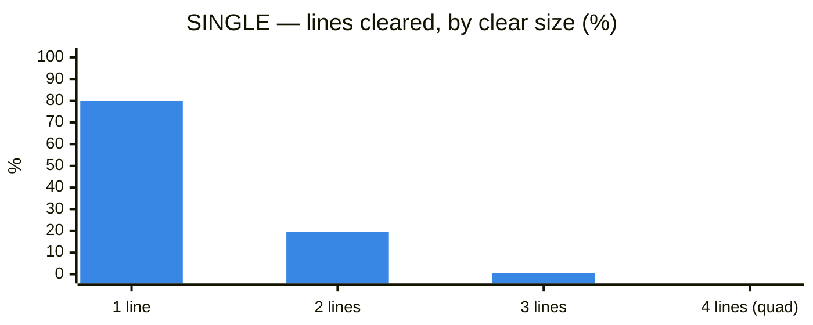
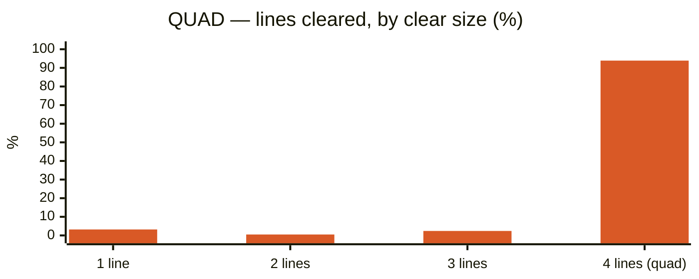
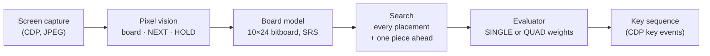
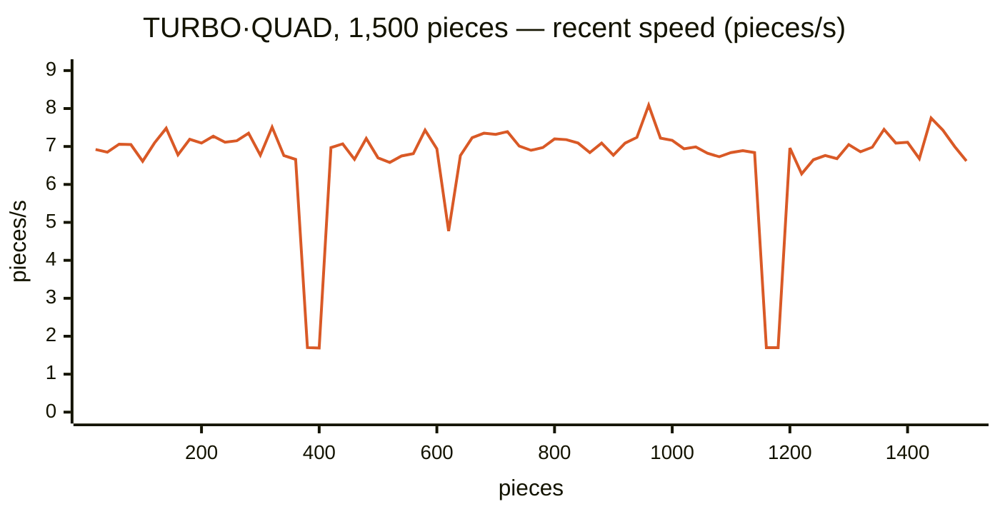

<p align="center">
  
</p>

<h1 align="center">Tetrio-AI</h1>

<p align="center">
  An autonomous player for TETR.IO's ZEN mode. It reads the screen of the desktop app,<br>
  decides every placement with a local evaluator, and plays at up to about 7 pieces per second.
</p>

<p align="center">
  
  
  
  
  
  <br>
  
  
  
</p>

<p align="center"><b>English</b> · <a href="README.ko.md">한국어</a></p>

> For research into TETR.IO gameplay. Using it in ranked or other competitive modes can get your account restricted, and that risk is yours.

New to Tetris or TETR.IO? Start with the [glossary](#glossary).

## Quick start

You need Node.js 18 or later and the TETR.IO desktop app (`%LOCALAPPDATA%\Programs\tetrio-desktop\TETR.IO.exe`).

```bash
npm install
npm start
```

A menu appears once the bot finds the ZEN screen. Type `[speed]-[strategy]` and Enter in the console to pick both; the same command switches them during play.

| | SINGLE (`s`) | QUAD (`q`) |
|---|---|---|
| **BASIC** (`1`) | `1-s` | `1-q` |
| **RAPID** (`2`) | `2-s` | `2-q` |
| **TURBO** (`3`) | `3-s` | `3-q` |

`status` prints statistics and `Ctrl+C` quits. Keep the TETR.IO window uncovered while it plays: a hidden window pauses the game.

The bot runs TETR.IO with its debug port (9222) open, and the app keeps running that way after the bot exits. While the port is open, other programs on the same PC can drive the logged-in game, so close TETR.IO when you are done.

## Speeds

| Speed | How it plays | Measured pieces/s |
|---|---|---:|
| BASIC | Reads the screen after every piece, then decides and presses keys | 2.3–2.4 |
| RAPID | Reads the screen and decides while waiting for the next piece | 4.1–4.3 |
| TURBO | Plans up to two pieces ahead with input timing calibrated per window size, and checks the screen in the background | 5.8–7.0 |

**Blue = SINGLE, orange = QUAD.** Measured on stretches without a level transition.

```mermaid
%%{init: {"xyChart": {"height": 360}, "themeVariables": {"xyChart": {"plotColorPalette": "#3987e5, #d95926"}}}}%%
xychart-beta
    title "Play speed by speed and strategy (pieces/s)"
    x-axis ["BASIC·SINGLE", "BASIC·QUAD", "RAPID·SINGLE", "RAPID·QUAD", "TURBO·SINGLE", "TURBO·QUAD"]
    y-axis "pieces/s" 0 --> 8
    %% A negative value draws no bar: mermaid draws 0 as an 8px bar.
    bar [2.42, -5, 4.13, -5, 5.84, -5]
    bar [-5, 2.33, -5, 4.29, -5, 6.99]
```



## Line-clear strategies

| Strategy | How it plays |
|---|---|
| SINGLE | Clears a line as soon as it can; mostly single-line clears |
| QUAD | Keeps the right-hand column empty, stacks the rest, and clears four lines at once with a vertical I. Above 10 rows it clears like SINGLE until the stack is low again |





QUAD scores **2.5 times** as many points per piece as SINGLE (110.7 against 44.0), and 93.5–95% of its lines were quads in the real game too. The price is a taller stack: 5.4 rows on average against 2.8. The shares and scores come from 18,000 simulated pieces per strategy.

## How the AI works

The "AI" is not a trained neural network. It is a classic search over every possible placement, scored by a formula with a handful of weights. It needs no GPU, no training data and no network access, and it decides in under 2 ms.



1. **Vision:** the bot reads the 10×20 field cell by cell. A cell counts as filled when its colour is bright and saturated enough, and its hue names the piece (yellow O, cyan I, and so on). NEXT and HOLD pieces are recognised by shape. Nothing here is learned; the thresholds are fixed.
2. **Search:** every placement the keys can reach (rotation × column, at most 34 per piece) is tried for the current piece and for the held piece. The bot then looks one piece ahead from each result. That is up to about 2,300 boards per decision; RAPID and TURBO look ahead only from the best 12.
3. **Evaluation:** each resulting board gets a score, and the highest wins.

### Parameters

SINGLE uses Pierre Dellacherie's hand-tuned evaluator (2003; see Thiery & Scherrer, *Building Controllers for Tetris*, 2009):

| Feature | Weight |
|---|---:|
| Landing height of the piece | −4.500 |
| Eroded cells (lines cleared × own cells in them) | +3.418 |
| Row transitions (filled ↔ empty, left to right) | −3.217 |
| Column transitions (filled ↔ empty, top to bottom) | −9.348 |
| Holes | −7.899 |
| Cumulative well depth | −3.386 |

QUAD keeps the same stack terms, treats the right-hand column as a wall, and replaces the eroded-cells term with:

| Term | Value |
|---|---:|
| Each filled cell in the right-hand column | −20 |
| A four-line clear | +60 |
| Each line cleared one to three at a time | −10 |
| An I piece kept in HOLD | +30 |
| Stack height at which QUAD scores like SINGLE | 10 rows |

Other settings: RAPID subtracts 1 point per key press so near-equal placements need fewer keys, and TURBO subtracts 0.01 points per millisecond of expected input time instead. In total the evaluator has **11 hand-set values (6 SINGLE + 5 QUAD) and no learned parameters**.

### How the weights were chosen

- **SINGLE:** Dellacherie's published weights, used as they are.
- **QUAD:** tuned offline with [`probe/quad_sim.js`](probe/quad_sim.js), a Tetris simulator with the same rules the bot sees (7-bag, five NEXT pieces, HOLD).
  - About 30 weight combinations were played, each for at least 6,000 pieces, and compared on the share of quads, score per piece, stack height and game-overs.
  - The best combination was checked on six unseen piece sequences of 3,000 pieces each, then confirmed in the real game (93.5–95% quads).
- **TURBO input timing:** measured, not tuned. The first time TURBO runs at a window size, it plays 120 pieces at each spawn delay (120, 95, 80, 65 ms) and keeps the fastest one with no misplacement.

## Real-game results



TURBO·QUAD placed 1,500 pieces in 282 s with 140 quads and no misplacement, holding about 7 pieces/s. The three dips are two level transitions and one tall stack, where RAPID took over until TURBO could resume.

Every run and the source of each chart are in the **[play log index](docs/PLAY-LOGS-KR.md)** (Korean).

## Options

| Option | Default | Purpose |
|---|---|---|
| `--mode basic/rapid/turbo` | basic | Starting speed |
| `--strategy single/quad` (`s`/`q`) | single | Line-clear strategy |
| `--pieces N` | unlimited | Stop after N pieces |
| `--port P` | 9222 | CDP port |
| `--calibration FILE` | chosen per window size | Use only this TURBO calibration file |
| `--restart` | off | Restart the app first |
| `--restart-every N` / `--restart-mins M` | 2500 / 20 | Restart the app on whichever comes first; 0 turns one off |
| `--quality Q` | 85 | JPEG capture quality (1–100) |
| `--postdrop N` | per speed | BASIC/RAPID wait after a hard drop (ms, at least 90) |
| `--no-adblock` | off | Turn off ad blocking |

TURBO needs its input timing calibrated for each window size. At a new size it calibrates itself when it starts, which takes 2–4 minutes. A maximized window can fail calibration, so run TURBO in a normal window. See [TURBO: how it works and results](docs/TURBO-RESULTS-KR.md#실행과-보정) (Korean).

## Glossary

| Term | Meaning |
|---|---|
| TETR.IO | An online Tetris game. This bot drives its Windows desktop app |
| ZEN | TETR.IO's endless single-player mode. Levels rise as you clear lines, and progress is saved to your account |
| Piece | A four-cell block (mino). There are seven: I, O, T, S, Z, J, L |
| PPS | Pieces per second |
| Stack | The blocks piled up from the bottom of the field, measured in rows |
| Line clear | A full row disappears. One row at a time is a single, four at once is a quad; among ordinary clears, quads score the most per line |
| Hard drop | The key that drops a piece straight to the bottom |
| NEXT | The preview of the next five pieces |
| HOLD | A slot that stores the current piece for later |
| 7-bag | The seven pieces are shuffled and dealt one full set at a time, so no piece stays away for long |
| Level transition | The animation when the level goes up. The field is hard to read meanwhile, so the bot slows down briefly |
| Misplacement | A piece that landed somewhere other than where the bot planned, as judged from the screen |
| CDP | Chrome DevTools Protocol, the channel used to capture the app's screen and send keys |
| Calibration | TURBO measuring and saving its key timing for a window size |
| DAS / ARR | The delay before a held arrow key starts repeating, and the repeat speed (game settings) |

## Development

`npm test` runs the regression tests. The AI is in `src/ai.js`, the board model in `src/board.js`, the BASIC/RAPID loop in `src/bot.js`, and TURBO in `src/turbo.js`.

Documents (Korean):

- [Play log index](docs/PLAY-LOGS-KR.md)
- [TURBO: how it works and results](docs/TURBO-RESULTS-KR.md)
- [BASIC and RAPID safeguards](docs/LEGACY-DEBUG-KR.md)
