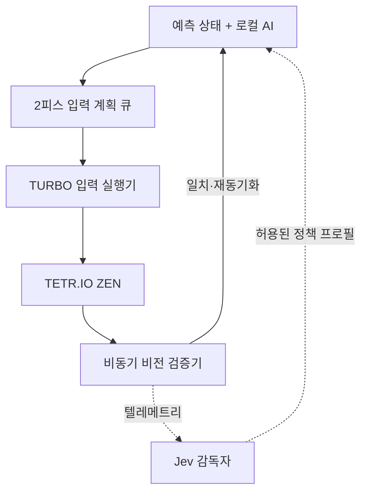

# Tetrio-AI `TURBO` 모드 설계 백서

> 버전: v0.1.0 · 작성일: 2026-09-21 · 상태: 구현 제안 
> 기준 코드: [`Tetrio-AI` `37ad463`](https://github.com/JTech-CO/Tetrio-AI/tree/37ad4633e203bb7c9f28f3db57a854a5566e79af) · 적용 범위: 데스크톱 앱의 ZEN 연구·실험 모드만

## 목표와 판단

현재 `RAPID`는 `runKeys()` 약 105 ms와 고정 스폰 여유 95 ms, 루프 오버헤드를 합쳐 이론상 약 4.2~4.5 PPS에서 막힌다. 캡처와 `pickMove()`는 이미 대기 구간에 겹쳐 있으므로 AI를 Jev로 교체하거나 `postDropMs`만 낮추는 것으로는 이 한계를 안정적으로 넘기 어렵다. `TURBO`의 목표는 **피스마다 화면을 읽은 뒤 움직이는 구조를, 예측 실행 후 비동기로 검증하는 구조로 전환**하여 500피스 구간 지속 5.0 PPS 이상을 달성하는 것이다. `BASIC`과 `RAPID`의 코드는 회귀 기준이므로 동작을 바꾸지 않는다.

## 핵심 설계

1. **예측 상태를 주 경로로 사용한다.** 현재 보드, `current`, `hold`, `next[]`를 하나의 `GameState`로 만들고 선택한 수의 `expectedResult`를 즉시 적용한다. 다음 피스의 수읽기는 화면 캡처를 기다리지 않고 이 예측 상태에서 실행한다. 최대 두 피스의 입력 계획만 준비해 오래된 계획의 연쇄 실행을 막는다.
2. **입력을 키 배열이 아닌 시간 계획으로 바꾼다.** 가까운 열은 기존 탭, 먼 열·벽 배치는 DAS/ARR 방향 홀드, 회전과 첫 이동은 검증된 경우에만 겹친다. 다음 피스의 방향키를 스폰 전부터 눌러 DAS를 충전하고, 모든 이벤트는 하드드롭 시각을 기준으로 단조 시계에서 예약한다. CDP 응답을 매 이벤트마다 기다리지 않되 전송 순서와 마지막 오류는 확인하며, 실패 시 모든 키를 강제로 올린다. 실제 DAS·ARR·스폰 가능 시각은 추정하지 않고 전용 프로브로 측정한다.
3. **비전은 검증 경로로 내린다.** 보드 전용 작은 JPEG를 별도 CDP 세션에서 4피스마다 읽고, 라인 클리어·HOLD·높은 스택·입력 오류 때는 즉시 읽는다. 캡처에는 피스 시퀀스 번호를 붙여 오래된 결과를 버린다. 예측과 다르면 계획 큐를 비우고 키를 해제한 뒤 전체 상태를 한 번 읽어 재동기화한다. 연속 불일치, 검증 지연 또는 CDP 오류가 발생하면 자동으로 `RAPID`로 내려간다.
4. **라인 클리어는 보수적으로 처리한다.** 시뮬레이터가 클리어를 예측한 턴은 입력 선행 충전을 중지하고, `settleClearMs` 이후 즉시 검증한 다음 파이프라인을 다시 채운다. 평균 속도를 조금 양보해 애니메이션으로 인한 장거리 드리프트를 차단한다.

## 코드 변경 지도

| 위치 | 변경 내용 |
|---|---|
| `src/modes.js` | `TURBO`와 콘솔 선택키 `3`/`T` 추가. `predictDepth: 2`, `verifyEvery: 4`, `turboFallback`, 보정값 경로 등만 선언한다. 기존 두 프리셋은 유지한다. |
| `src/state.js` 신규 | 보드·현재 피스·HOLD·NEXT를 함께 갱신하는 순수 `applyMove()`를 구현한다. 빈 HOLD와 교환 HOLD의 큐 소비량을 각각 검증한다. |
| `src/input/planner.js` 신규 | `(piece, rot, col, useHold, calibration)`을 탭/DAS/ARR/회전/드롭의 타임라인으로 컴파일하고 예상 실행 시간을 반환한다. |
| `src/input/executor.js` 신규 | 하드드롭 기준 예약, 스폰 전 DAS 충전, 순서 보장형 비동기 CDP 전송, 취소, `releaseAll()`을 담당한다. |
| `src/runtime/cdp.js` | 저수준 `dispatchKeyEventFast()`와 독립 캡처 세션 연결만 추가한다. 기존 `tap()`·`keyDown()`·`keyUp()` 계약은 변경하지 않는다. |
| `src/ai.js` | 후보의 단순 키 개수 대신 `estimatedInputMs`를 작은 패널티로 반영하고, 결과에 실제 배치 피스와 입력 계획용 메타데이터를 포함한다. 보드 품질 가중치가 속도보다 우선한다. |
| `src/vision/vision.js` | HOLD/NEXT 분석을 생략하는 보드 전용 검증 읽기와 작은 필드 전용 캡처 영역을 추가한다. 불일치 때만 기존 전체 `readState()`를 사용한다. |
| `src/bot.js` | 기존 `run()`은 보존하고 `runTurbo()`를 분리한다. Predictor → Executor → Observer의 시퀀스 번호, 계획 큐, 재동기화 및 `RAPID` 폴백을 관리한다. |
| `src/run.js` | `--mode turbo`, TURBO 상태·실효 PPS·검증 지연·폴백 원인을 출력한다. 라이브 모드 전환은 피스 경계에서만 적용한다. |
| `probe/turbo_calibrate.js`, `probe/validate_turbo.js` 신규 | DAS/ARR·스폰 선행 입력·동시 입력의 안전 구간을 저장하고, `RAPID` 대조군과 500피스 A/B 검증을 수행한다. 보정 실패 시 TURBO를 시작하지 않는다. |

## Jev의 위치

Jev는 Canvas 보드 판독과 키 입력을 담당하지 않으며, 매 피스 경로에도 들어가지 않는다. 현재 Jev의 중앙 결정 지연 중앙값은 약 178 ms이고 임의 키보드 위젯과 Canvas는 MVP 범위 밖이므로, 200 ms 미만의 피스 주기에는 맞지 않는다. 대신 `tools/jev-supervisor/`의 선택형 사이드카와 `src/jev/client.js`를 두고 **20피스마다 또는 위험 이벤트 때만** 다음 텔레메트리를 비동기로 보낸다: PPS, 구멍 수, 최대 높이, 입력 계획 시간, 불일치율, 재동기화 수, 캡처 지연.

Jev가 고를 수 있는 출력은 `SAFE`, `BALANCED`, `SPEED`, `RESYNC` 네 개의 인덱스형 정책뿐이다. 각 정책은 로컬에서 고정·검증된 `verifyEvery`, AI beam, 입력 비용 패널티만 선택하며, 보정된 최소 키 시간보다 낮은 값을 만들거나 실제 키·좌표·코드를 생성할 수 없다. 응답은 플레이 루프가 기다리지 않고 다음 안전한 피스 경계에서만 적용하며, 타임아웃·형식 오류·API 부재 시 `BALANCED`를 계속 사용한다.

## 완료 기준과 구현 순서

- 먼저 입력 보정과 시간 계획 실행기를 만들고, 기존 `RAPID`와 동일한 보드에서 입력 결과가 일치하는지 확인한다.
- 다음으로 `GameState` 예측과 비동기 보드 검증을 붙인다. 라인 클리어 턴은 보수 경로를 유지한다.
- 합격 기준은 **500피스 지속 5.0 PPS 이상, 오배치 추정 3% 이하, 강제 재동기화 100피스당 1회 이하, 고착 키 0회**다. 1,000피스 장기 주행에서는 입력 오류로 인한 탑아웃이 없어야 한다.
- Jev 감독자는 로컬 TURBO가 위 기준을 먼저 통과한 뒤 마지막에 추가한다. Jev를 끈 상태와 켠 상태의 raw PPS가 같아야 올바른 통합이다.

핵심은 `RAPID`의 상수를 더 공격적으로 낮추는 것이 아니라, **로컬 AI와 예측 상태가 실행을 주도하고 화면은 사실 확인만 하도록 책임을 뒤집는 것**이다. 이 구조에서만 캡처 지연과 Jev 네트워크 지연을 임계 경로 밖에 둔 채 4.5 PPS 장벽을 안정적으로 넘길 수 있다.

---

참고: [`modes.js`](https://github.com/JTech-CO/Tetrio-AI/blob/37ad4633e203bb7c9f28f3db57a854a5566e79af/src/modes.js) · [`bot.js`](https://github.com/JTech-CO/Tetrio-AI/blob/37ad4633e203bb7c9f28f3db57a854a5566e79af/src/bot.js) · [`ai.js`](https://github.com/JTech-CO/Tetrio-AI/blob/37ad4633e203bb7c9f28f3db57a854a5566e79af/src/ai.js) · [`cdp.js`](https://github.com/JTech-CO/Tetrio-AI/blob/37ad4633e203bb7c9f28f3db57a854a5566e79af/src/runtime/cdp.js) · [`Jev 성능 측정`](https://github.com/JTech-CO/jev-ultrafast/blob/1231850a0bf1a0c0341fe408ef1668dbbfdfac46/docs/performance.md) · [`Jev 선택 계약`](https://github.com/JTech-CO/jev-ultrafast/blob/1231850a0bf1a0c0341fe408ef1668dbbfdfac46/jev_ultrafast/model.py)
